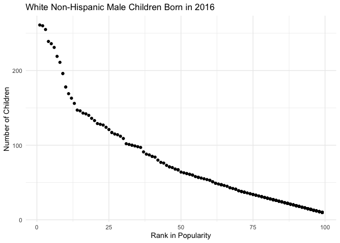

Homework2
================

\#\#Problem 1 Import and view I will import the Mr. Trash Wheel sheet,
clean its column names, and examine the structure, head, and tail of the
data set.

Then, I will view the data set.

``` r
df_one = read_excel("Trash-Wheel-Collection-Totals-7-2020-2.xlsx", sheet = "Mr. Trash Wheel")
```

    ## New names:
    ## * `` -> ...15
    ## * `` -> ...16
    ## * `` -> ...17

``` r
df_one = janitor::clean_names(df_one)
str(df_one)
```

    ## tibble [533 × 17] (S3: tbl_df/tbl/data.frame)
    ##  $ dumpster          : chr [1:533] "1" "2" "3" "4" ...
    ##  $ month             : chr [1:533] "May" "May" "May" "May" ...
    ##  $ year              : num [1:533] 2014 2014 2014 2014 2014 ...
    ##  $ date              : POSIXct[1:533], format: "2014-05-16" "2014-05-16" ...
    ##  $ weight_tons       : num [1:533] 4.31 2.74 3.45 3.1 4.06 ...
    ##  $ volume_cubic_yards: num [1:533] 18 13 15 15 18 13 8 16 116 14 ...
    ##  $ plastic_bottles   : num [1:533] 1450 1120 2450 2380 980 1430 910 3580 14300 2400 ...
    ##  $ polystyrene       : num [1:533] 1820 1030 3100 2730 870 ...
    ##  $ cigarette_butts   : num [1:533] 126000 91000 105000 100000 120000 90000 56000 112000 800000 98000 ...
    ##  $ glass_bottles     : num [1:533] 72 42 50 52 72 46 32 58 424 49 ...
    ##  $ grocery_bags      : num [1:533] 584 496 1080 896 368 ...
    ##  $ chip_bags         : num [1:533] 1162 874 2032 1971 753 ...
    ##  $ sports_balls      : num [1:533] 7.2 5.2 6 6 7.2 5.2 3.2 6.4 46.4 5.6 ...
    ##  $ homes_powered     : num [1:533] 0 0 0 0 0 0 0 0 0 0 ...
    ##  $ x15               : chr [1:533] NA NA NA NA ...
    ##  $ x16               : logi [1:533] NA NA NA NA NA NA ...
    ##  $ x17               : logi [1:533] NA NA NA NA NA NA ...

``` r
head(df_one)
```

    ## # A tibble: 6 × 17
    ##   dumpster month  year date                weight_tons volume_cubic_yards
    ##   <chr>    <chr> <dbl> <dttm>                    <dbl>              <dbl>
    ## 1 1        May    2014 2014-05-16 00:00:00        4.31                 18
    ## 2 2        May    2014 2014-05-16 00:00:00        2.74                 13
    ## 3 3        May    2014 2014-05-16 00:00:00        3.45                 15
    ## 4 4        May    2014 2014-05-17 00:00:00        3.1                  15
    ## 5 5        May    2014 2014-05-17 00:00:00        4.06                 18
    ## 6 6        May    2014 2014-05-20 00:00:00        2.71                 13
    ## # … with 11 more variables: plastic_bottles <dbl>, polystyrene <dbl>,
    ## #   cigarette_butts <dbl>, glass_bottles <dbl>, grocery_bags <dbl>,
    ## #   chip_bags <dbl>, sports_balls <dbl>, homes_powered <dbl>, x15 <chr>,
    ## #   x16 <lgl>, x17 <lgl>

``` r
tail(df_one)
```

    ## # A tibble: 6 × 17
    ##   dumpster    month            year date                weight_tons volume_cubic_ya…
    ##   <chr>       <chr>           <dbl> <dttm>                    <dbl>            <dbl>
    ## 1 451         Decemeber        2020 2020-12-30 00:00:00        2.73               15
    ## 2 452         Decemeber        2020 2020-12-30 00:00:00        2.12               15
    ## 3 <NA>        Decemeber Total    NA NA                        38.8               210
    ## 4 453         January          2021 2021-01-04 00:00:00        2.81               15
    ## 5 <NA>        January  Total     NA NA                         2.81               15
    ## 6 Grand Total <NA>               NA NA                      1450.               6982
    ## # … with 11 more variables: plastic_bottles <dbl>, polystyrene <dbl>,
    ## #   cigarette_butts <dbl>, glass_bottles <dbl>, grocery_bags <dbl>,
    ## #   chip_bags <dbl>, sports_balls <dbl>, homes_powered <dbl>, x15 <chr>,
    ## #   x16 <lgl>, x17 <lgl>

``` r
view(df_one)
```

\#Clean dataset

I will omit the last columns ‘x15’, ‘x16’, and ‘x17’, which do not
contain data. Then I will drop other ‘NA’ values.

``` r
df_two = select(df_one, -c("x15", "x16", "x17"))
view(df_two)
df_three = drop_na(df_two)
view(df_three)
```

\#Calculate the number of sports balls

``` r
sb = select(df_three, "sports_balls")
sum(sb)
```

    ## [1] 5322.6

4065 is the closest integer value of sports balls

This calculation could also be achieved by the “pull” function, which I
will show below

``` r
df_three %>% pull("sports_balls") %>% sum()
```

    ## [1] 5322.6

\#Import and view

I will import the 2019 precipitation sheet, clean its column names, and
examine the structure, head, and tail of the data set.

Then, I will view the data set.

``` r
df_four = read_excel("Trash-Wheel-Collection-Totals-7-2020-2.xlsx", sheet = "2019 Precipitation")
```

    ## New names:
    ## * `` -> ...2

``` r
df_four = janitor::clean_names(df_four)
str(df_four)
```

    ## tibble [14 × 2] (S3: tbl_df/tbl/data.frame)
    ##  $ precipitation_in: chr [1:14] "Month" "1" "2" "3" ...
    ##  $ x2              : chr [1:14] "Total" "3.1" "3.64" "4.47" ...

``` r
head(df_four)
```

    ## # A tibble: 6 × 2
    ##   precipitation_in x2   
    ##   <chr>            <chr>
    ## 1 Month            Total
    ## 2 1                3.1  
    ## 3 2                3.64 
    ## 4 3                4.47 
    ## 5 4                1.46 
    ## 6 5                3.58

``` r
tail(df_four)
```

    ## # A tibble: 6 × 2
    ##   precipitation_in x2                
    ##   <chr>            <chr>             
    ## 1 8                2.39              
    ## 2 9                0.16              
    ## 3 10               5.45              
    ## 4 11               1.86              
    ## 5 12               3.57              
    ## 6 <NA>             33.950000000000003

``` r
view(df_four)
```

The first row contains column names. I will clean the column names.

``` r
df_five = read_excel("Trash-Wheel-Collection-Totals-7-2020-2.xlsx", sheet = "2019 Precipitation", skip = 1, col_names = TRUE)
df_five = janitor::clean_names(df_five)
str(df_five)
```

    ## tibble [13 × 2] (S3: tbl_df/tbl/data.frame)
    ##  $ month: num [1:13] 1 2 3 4 5 6 7 8 9 10 ...
    ##  $ total: num [1:13] 3.1 3.64 4.47 1.46 3.58 0.42 3.85 2.39 0.16 5.45 ...

``` r
head(df_five)
```

    ## # A tibble: 6 × 2
    ##   month total
    ##   <dbl> <dbl>
    ## 1     1  3.1 
    ## 2     2  3.64
    ## 3     3  4.47
    ## 4     4  1.46
    ## 5     5  3.58
    ## 6     6  0.42

``` r
tail(df_five)
```

    ## # A tibble: 6 × 2
    ##   month total
    ##   <dbl> <dbl>
    ## 1     8  2.39
    ## 2     9  0.16
    ## 3    10  5.45
    ## 4    11  1.86
    ## 5    12  3.57
    ## 6    NA 34.0

``` r
view(df_five)
```

Now I will omit rows with missing data

``` r
df_six = drop_na(df_five)
view(df_six)
```

I will add a year column to this data set

``` r
df_2019 = df_six %>% mutate(year = 2019)
view(df_2019)
```

Now I will move on to the 2018 precipitation sheet

``` r
df_seven = read_excel("Trash-Wheel-Collection-Totals-7-2020-2.xlsx", sheet = "2018 Precipitation")
```

    ## New names:
    ## * `` -> ...2

``` r
df_seven = janitor::clean_names(df_seven)
str(df_seven)
```

    ## tibble [14 × 2] (S3: tbl_df/tbl/data.frame)
    ##  $ precipitation_in: chr [1:14] "Month" "1" "2" "3" ...
    ##  $ x2              : chr [1:14] "Total" "0.94" "4.8" "2.69" ...

``` r
head(df_seven)
```

    ## # A tibble: 6 × 2
    ##   precipitation_in x2                
    ##   <chr>            <chr>             
    ## 1 Month            Total             
    ## 2 1                0.94              
    ## 3 2                4.8               
    ## 4 3                2.69              
    ## 5 4                4.6900000000000004
    ## 6 5                9.27

``` r
tail(df_seven)
```

    ## # A tibble: 6 × 2
    ##   precipitation_in x2   
    ##   <chr>            <chr>
    ## 1 8                6.45 
    ## 2 9                10.47
    ## 3 10               2.12 
    ## 4 11               7.82 
    ## 5 12               6.11 
    ## 6 <NA>             70.33

``` r
view(df_seven)
```

The first row contains column names. I will clean the column names and
drop the NA values

``` r
df_eight = read_excel("Trash-Wheel-Collection-Totals-7-2020-2.xlsx", sheet = "2018 Precipitation", skip = 1, col_names = TRUE)
df_eight = janitor::clean_names(df_eight)
str(df_eight)
```

    ## tibble [13 × 2] (S3: tbl_df/tbl/data.frame)
    ##  $ month: num [1:13] 1 2 3 4 5 6 7 8 9 10 ...
    ##  $ total: num [1:13] 0.94 4.8 2.69 4.69 9.27 ...

``` r
head(df_eight)
```

    ## # A tibble: 6 × 2
    ##   month total
    ##   <dbl> <dbl>
    ## 1     1  0.94
    ## 2     2  4.8 
    ## 3     3  2.69
    ## 4     4  4.69
    ## 5     5  9.27
    ## 6     6  4.77

``` r
tail(df_eight)
```

    ## # A tibble: 6 × 2
    ##   month total
    ##   <dbl> <dbl>
    ## 1     8  6.45
    ## 2     9 10.5 
    ## 3    10  2.12
    ## 4    11  7.82
    ## 5    12  6.11
    ## 6    NA 70.3

``` r
view(df_eight)
df_nine = drop_na(df_eight)
view(df_nine)
```

I will add a year column to this data set.

``` r
df_2018 = df_nine %>% mutate(year = 2018)
view(df_2018)
```

I will convert from numeric value to month name for 2018.

``` r
df_2018_m = df_2018 %>% mutate(month_name = month.name[month])
view(df_2018_m)
```

I will convert from numeric value to month name for 2019.

``` r
df_2019_m = df_2019 %>% mutate(month_name = month.name[month])
view(df_2019_m)
```

I will merge precipitation datasets.

``` r
precipitation = merge(df_2018_m, df_2019_m, by = c("year", "month", "month_name", "total"), all=TRUE)
view(precipitation)
```

I will remove then numeric month column from the dataset. Then, I will
rename the month\_name column as month to merge with the Mr. Trash Wheel
dataset better.

``` r
precipitation_m = precipitation %>% select("year", "month_name", "total") %>% rename("month" = "month_name", "total_precipitation" = "total")
view(precipitation_m)
```

I will characterize the precipitation data sets by viewing the
structure, head and tail.

``` r
str(precipitation)
```

    ## 'data.frame':    24 obs. of  4 variables:
    ##  $ year      : num  2018 2018 2018 2018 2018 ...
    ##  $ month     : num  1 2 3 4 5 6 7 8 9 10 ...
    ##  $ month_name: chr  "January" "February" "March" "April" ...
    ##  $ total     : num  0.94 4.8 2.69 4.69 9.27 ...

``` r
head(precipitation)
```

    ##   year month month_name total
    ## 1 2018     1    January  0.94
    ## 2 2018     2   February  4.80
    ## 3 2018     3      March  2.69
    ## 4 2018     4      April  4.69
    ## 5 2018     5        May  9.27
    ## 6 2018     6       June  4.77

``` r
tail(precipitation)
```

    ##    year month month_name total
    ## 19 2019     7       July  3.85
    ## 20 2019     8     August  2.39
    ## 21 2019     9  September  0.16
    ## 22 2019    10    October  5.45
    ## 23 2019    11   November  1.86
    ## 24 2019    12   December  3.57

This data set has 18 observations and 4 variables. There are 4 columns.
Of those, 3 columns are in numerical format and month\_name is in a
character format.

I will merge Mr. Trash Wheel with precipitation data.

``` r
data_set_full = merge(df_three, precipitation_m, by = c("year", "month"), all=TRUE)
view(data_set_full)
```

I will characterize the merged data sets by viewing the structure, head
and tail.

``` r
str(data_set_full)
```

    ## 'data.frame':    454 obs. of  15 variables:
    ##  $ year               : num  2014 2014 2014 2014 2014 ...
    ##  $ month              : chr  "August" "August" "August" "August" ...
    ##  $ dumpster           : chr  "25" "26" "27" "28" ...
    ##  $ date               : POSIXct, format: "2014-08-04" "2014-08-04" ...
    ##  $ weight_tons        : num  4.39 5.33 3.58 3.1 1.77 1.81 3.48 3.18 2.54 2.41 ...
    ##  $ volume_cubic_yards : num  16 17 20 17 10 17 15 15 15 15 ...
    ##  $ plastic_bottles    : num  2140 1630 3640 1430 570 1370 550 640 1640 1730 ...
    ##  $ polystyrene        : num  2050 1950 4360 1870 780 3140 1450 1670 1960 2100 ...
    ##  $ cigarette_butts    : num  118000 123000 141000 121000 32000 38000 22000 26000 108000 107000 ...
    ##  $ glass_bottles      : num  68 75 82 63 21 28 34 42 65 63 ...
    ##  $ grocery_bags       : num  904 512 1560 552 310 950 740 880 744 896 ...
    ##  $ chip_bags          : num  1762 1318 3067 1144 1440 ...
    ##  $ sports_balls       : num  6.4 6.8 8 6.8 4 6.8 6 6 6 6 ...
    ##  $ homes_powered      : num  0 0 0 0 0 0 0 0 0 0 ...
    ##  $ total_precipitation: num  NA NA NA NA NA NA NA NA NA NA ...

``` r
head(data_set_full)
```

    ##   year    month dumpster       date weight_tons volume_cubic_yards
    ## 1 2014   August       25 2014-08-04        4.39                 16
    ## 2 2014   August       26 2014-08-04        5.33                 17
    ## 3 2014   August       27 2014-08-13        3.58                 20
    ## 4 2014   August       28 2014-08-13        3.10                 17
    ## 5 2014   August       29 2014-08-19        1.77                 10
    ## 6 2014 December       42 2014-12-01        1.81                 17
    ##   plastic_bottles polystyrene cigarette_butts glass_bottles grocery_bags
    ## 1            2140        2050          118000            68          904
    ## 2            1630        1950          123000            75          512
    ## 3            3640        4360          141000            82         1560
    ## 4            1430        1870          121000            63          552
    ## 5             570         780           32000            21          310
    ## 6            1370        3140           38000            28          950
    ##   chip_bags sports_balls homes_powered total_precipitation
    ## 1      1762          6.4             0                  NA
    ## 2      1318          6.8             0                  NA
    ## 3      3067          8.0             0                  NA
    ## 4      1144          6.8             0                  NA
    ## 5      1440          4.0             0                  NA
    ## 6      1620          6.8             0                  NA

``` r
tail(data_set_full)
```

    ##     year     month dumpster       date weight_tons volume_cubic_yards
    ## 449 2020   October      434 2020-10-30        2.98                 15
    ## 450 2020   October      435 2020-10-31        3.39                 15
    ## 451 2020 September      429 2020-09-04        3.52                 15
    ## 452 2020 September      430 2020-09-04        3.39                 15
    ## 453 2020 September      431 2020-09-12        2.36                 15
    ## 454 2021   January      453 2021-01-04        2.81                 15
    ##     plastic_bottles polystyrene cigarette_butts glass_bottles grocery_bags
    ## 449            3000        1850            3000            12          680
    ## 450            2200        1200            3200            12          300
    ## 451            3250        1500            4000            14          820
    ## 452            2100        1420            3200            10          680
    ## 453            2450        1640            4500            18          500
    ## 454            1600         840            3400            24          320
    ##     chip_bags sports_balls homes_powered total_precipitation
    ## 449       880           14      49.66667                  NA
    ## 450       480            8      56.50000                  NA
    ## 451       800           12      58.66667                  NA
    ## 452       650           20      56.50000                  NA
    ## 453       640           18      39.33333                  NA
    ## 454       540           12      46.83333                  NA

The data set has 344 observations and is 344 x 15 in size. There are 15
columns. Of those, 13 are in nmerical format. 1 column is a character
format and the date column is in time stamp format.

I will drop missing values from the dataset, which will remove all
values before 2018.

``` r
data_set_edit = drop_na(data_set_full)
view(data_set_edit)
```

I will characterize the new data set by viewing the structure, head and
tail.

``` r
str(data_set_edit)
```

    ## 'data.frame':    159 obs. of  15 variables:
    ##  $ year               : num  2018 2018 2018 2018 2018 ...
    ##  $ month              : chr  "April" "April" "April" "April" ...
    ##  $ dumpster           : chr  "240" "241" "239" "244" ...
    ##  $ date               : POSIXct, format: "2018-04-17" "2018-04-17" ...
    ##  $ weight_tons        : num  3.03 3.26 3.19 2.72 3.65 3.04 3.09 4.3 2.91 3.62 ...
    ##  $ volume_cubic_yards : num  15 15 15 15 15 15 15 15 15 15 ...
    ##  $ plastic_bottles    : num  810 790 750 730 820 670 710 2150 970 840 ...
    ##  $ polystyrene        : num  890 1020 830 840 980 840 910 2300 1100 920 ...
    ##  $ cigarette_butts    : num  5000 6000 6000 6000 7000 7000 7000 23000 8000 7000 ...
    ##  $ glass_bottles      : num  4 3 3 6 5 2 4 16 2 3 ...
    ##  $ grocery_bags       : num  200 150 190 280 170 230 310 1320 300 290 ...
    ##  $ chip_bags          : num  450 500 400 640 590 620 780 2070 800 650 ...
    ##  $ sports_balls       : num  3 4 4 2 5 3 4 12 1 4 ...
    ##  $ homes_powered      : num  50.5 54.3 53.2 45.3 60.8 ...
    ##  $ total_precipitation: num  4.69 4.69 4.69 4.69 4.69 4.69 4.69 4.69 4.69 4.69 ...

``` r
head(data_set_edit)
```

    ##   year month dumpster       date weight_tons volume_cubic_yards plastic_bottles
    ## 1 2018 April      240 2018-04-17        3.03                 15             810
    ## 2 2018 April      241 2018-04-17        3.26                 15             790
    ## 3 2018 April      239 2018-04-17        3.19                 15             750
    ## 4 2018 April      244 2018-04-18        2.72                 15             730
    ## 5 2018 April      245 2018-04-18        3.65                 15             820
    ## 6 2018 April      242 2018-04-17        3.04                 15             670
    ##   polystyrene cigarette_butts glass_bottles grocery_bags chip_bags sports_balls
    ## 1         890            5000             4          200       450            3
    ## 2        1020            6000             3          150       500            4
    ## 3         830            6000             3          190       400            4
    ## 4         840            6000             6          280       640            2
    ## 5         980            7000             5          170       590            5
    ## 6         840            7000             2          230       620            3
    ##   homes_powered total_precipitation
    ## 1      50.50000                4.69
    ## 2      54.33333                4.69
    ## 3      53.16667                4.69
    ## 4      45.33333                4.69
    ## 5      60.83333                4.69
    ## 6      50.66667                4.69

``` r
tail(data_set_edit)
```

    ##     year   month dumpster       date weight_tons volume_cubic_yards
    ## 154 2019 October      364 2019-10-18        3.07                 15
    ## 155 2019 October      368 2019-10-28        3.43                 15
    ## 156 2019 October      369 2019-10-28        3.28                 15
    ## 157 2019 October      370 2019-10-28        2.66                 15
    ## 158 2019 October      367 2019-10-25        3.25                 15
    ## 159 2019 October      371 2019-10-30        2.98                 15
    ##     plastic_bottles polystyrene cigarette_butts glass_bottles grocery_bags
    ## 154             980         800            2200             6          840
    ## 155            2440        2000            5300            10          350
    ## 156            3400        1880            7800            12          480
    ## 157             920        1240            4800             0          240
    ## 158            2780        2100            7200            16          940
    ## 159            1260        1480            3600            14          320
    ##     chip_bags sports_balls homes_powered total_precipitation
    ## 154      1100            4      51.16667                5.45
    ## 155      1400           12      57.16667                5.45
    ## 156      1580           20      54.66667                5.45
    ## 157       560            4      44.33333                5.45
    ## 158      1980           28      54.16667                5.45
    ## 159       880            2      49.66667                5.45

The data set has 123 observations and is 344 x 15 in size. There are 15
columns. Of those, 13 are in nmerical format. 1 column is a character
format and the date column is in time stamp format.

I will view the data set.

``` r
view(data_set_edit)
```

I will calculate the median precipitation in 2018.

``` r
 data_set_edit %>% filter (year == 2018) %>% pull (total_precipitation) %>% median()
```

    ## [1] 6.11

The median precipitation in 2018 was 6.11.

I will calculate the median sports balls in 2019.

``` r
 data_set_edit %>% filter (year == 2019) %>% pull (sports_balls) %>% median()
```

    ## [1] 9

The median number of sports balls was 8.5 in 2019.

I will calculate the median weight in tons, volume in cubic volume,
number of plastic bottles, amount of polystyrene, and homes powered in
2018.

``` r
 data_set_edit %>% filter (year == 2018) %>% pull (weight_tons) %>% median() ##weight
```

    ## [1] 3.31

``` r
data_set_edit %>% filter (year == 2018) %>% pull (volume_cubic_yards) %>% median() #cubic volume
```

    ## [1] 15

``` r
data_set_edit %>% filter (year == 2018) %>% pull (plastic_bottles) %>% median() #plastic bottles
```

    ## [1] 1200

``` r
data_set_edit %>% filter (year == 2018) %>% pull (polystyrene) %>% median() #ploystyrene
```

    ## [1] 1020

``` r
data_set_edit %>% filter (year == 2018) %>% pull (homes_powered) %>% median() #homes powered
```

    ## [1] 55.16667

The median weight is 3 tons, median volume is 15 cubic yards, number of
plastic botles is 1200, amount of polystyrene is 1020, and number of
homes powered is 55.

I will calculate the median weight in tons, volume in cubic volume,
number of plastic bottles, amount of polystyrene, and homes powered in
2019

``` r
 data_set_edit %>% filter (year == 2019) %>% pull (weight_tons) %>% median() ##weight
```

    ## [1] 3.055

``` r
data_set_edit %>% filter (year == 2019) %>% pull (volume_cubic_yards) %>% median() #cubic volume
```

    ## [1] 15

``` r
data_set_edit %>% filter (year == 2019) %>% pull (plastic_bottles) %>% median() #plastic bottles
```

    ## [1] 1800

``` r
data_set_edit %>% filter (year == 2019) %>% pull (polystyrene) %>% median() #ploystyrene
```

    ## [1] 1220

``` r
data_set_edit %>% filter (year == 2019) %>% pull (homes_powered) %>% median() #homes powered
```

    ## [1] 50.91667

The median weight is 3 tons, median volume is 15 cubic yards, number of
plastic botles is 1075, amount of polystyrene is 1350, and number of
homes powered is 51.

\#Problem 2 First,I will clean the data in pols-months and characterize
the data frame.

``` r
df_pols = read_csv("pols-month.csv")
```

    ## Rows: 822 Columns: 9

    ## ── Column specification ────────────────────────────────────────────────────────
    ## Delimiter: ","
    ## dbl  (8): prez_gop, gov_gop, sen_gop, rep_gop, prez_dem, gov_dem, sen_dem, r...
    ## date (1): mon

    ## 
    ## ℹ Use `spec()` to retrieve the full column specification for this data.
    ## ℹ Specify the column types or set `show_col_types = FALSE` to quiet this message.

``` r
df_pols = janitor::clean_names(df_pols)
str(df_pols)
```

    ## spec_tbl_df [822 × 9] (S3: spec_tbl_df/tbl_df/tbl/data.frame)
    ##  $ mon     : Date[1:822], format: "1947-01-15" "1947-02-15" ...
    ##  $ prez_gop: num [1:822] 0 0 0 0 0 0 0 0 0 0 ...
    ##  $ gov_gop : num [1:822] 23 23 23 23 23 23 23 23 23 23 ...
    ##  $ sen_gop : num [1:822] 51 51 51 51 51 51 51 51 51 51 ...
    ##  $ rep_gop : num [1:822] 253 253 253 253 253 253 253 253 253 253 ...
    ##  $ prez_dem: num [1:822] 1 1 1 1 1 1 1 1 1 1 ...
    ##  $ gov_dem : num [1:822] 23 23 23 23 23 23 23 23 23 23 ...
    ##  $ sen_dem : num [1:822] 45 45 45 45 45 45 45 45 45 45 ...
    ##  $ rep_dem : num [1:822] 198 198 198 198 198 198 198 198 198 198 ...
    ##  - attr(*, "spec")=
    ##   .. cols(
    ##   ..   mon = col_date(format = ""),
    ##   ..   prez_gop = col_double(),
    ##   ..   gov_gop = col_double(),
    ##   ..   sen_gop = col_double(),
    ##   ..   rep_gop = col_double(),
    ##   ..   prez_dem = col_double(),
    ##   ..   gov_dem = col_double(),
    ##   ..   sen_dem = col_double(),
    ##   ..   rep_dem = col_double()
    ##   .. )
    ##  - attr(*, "problems")=<externalptr>

``` r
head(df_pols)
```

    ## # A tibble: 6 × 9
    ##   mon        prez_gop gov_gop sen_gop rep_gop prez_dem gov_dem sen_dem rep_dem
    ##   <date>        <dbl>   <dbl>   <dbl>   <dbl>    <dbl>   <dbl>   <dbl>   <dbl>
    ## 1 1947-01-15        0      23      51     253        1      23      45     198
    ## 2 1947-02-15        0      23      51     253        1      23      45     198
    ## 3 1947-03-15        0      23      51     253        1      23      45     198
    ## 4 1947-04-15        0      23      51     253        1      23      45     198
    ## 5 1947-05-15        0      23      51     253        1      23      45     198
    ## 6 1947-06-15        0      23      51     253        1      23      45     198

``` r
tail(df_pols)
```

    ## # A tibble: 6 × 9
    ##   mon        prez_gop gov_gop sen_gop rep_gop prez_dem gov_dem sen_dem rep_dem
    ##   <date>        <dbl>   <dbl>   <dbl>   <dbl>    <dbl>   <dbl>   <dbl>   <dbl>
    ## 1 2015-01-15        0      31      54     245        1      18      44     188
    ## 2 2015-02-15        0      31      54     245        1      18      44     188
    ## 3 2015-03-15        0      31      54     245        1      18      44     188
    ## 4 2015-04-15        0      31      54     244        1      18      44     188
    ## 5 2015-05-15        0      31      54     245        1      18      44     188
    ## 6 2015-06-15        0      31      54     246        1      18      44     188

``` r
view(df_pols)
```

Now I will drop any missing values and reassess the data frame.

``` r
df_pols %>% drop_na()
```

    ## # A tibble: 822 × 9
    ##    mon        prez_gop gov_gop sen_gop rep_gop prez_dem gov_dem sen_dem rep_dem
    ##    <date>        <dbl>   <dbl>   <dbl>   <dbl>    <dbl>   <dbl>   <dbl>   <dbl>
    ##  1 1947-01-15        0      23      51     253        1      23      45     198
    ##  2 1947-02-15        0      23      51     253        1      23      45     198
    ##  3 1947-03-15        0      23      51     253        1      23      45     198
    ##  4 1947-04-15        0      23      51     253        1      23      45     198
    ##  5 1947-05-15        0      23      51     253        1      23      45     198
    ##  6 1947-06-15        0      23      51     253        1      23      45     198
    ##  7 1947-07-15        0      23      51     253        1      23      45     198
    ##  8 1947-08-15        0      23      51     253        1      23      45     198
    ##  9 1947-09-15        0      23      51     253        1      23      45     198
    ## 10 1947-10-15        0      23      51     253        1      23      45     198
    ## # … with 812 more rows

``` r
str(df_pols)
```

    ## spec_tbl_df [822 × 9] (S3: spec_tbl_df/tbl_df/tbl/data.frame)
    ##  $ mon     : Date[1:822], format: "1947-01-15" "1947-02-15" ...
    ##  $ prez_gop: num [1:822] 0 0 0 0 0 0 0 0 0 0 ...
    ##  $ gov_gop : num [1:822] 23 23 23 23 23 23 23 23 23 23 ...
    ##  $ sen_gop : num [1:822] 51 51 51 51 51 51 51 51 51 51 ...
    ##  $ rep_gop : num [1:822] 253 253 253 253 253 253 253 253 253 253 ...
    ##  $ prez_dem: num [1:822] 1 1 1 1 1 1 1 1 1 1 ...
    ##  $ gov_dem : num [1:822] 23 23 23 23 23 23 23 23 23 23 ...
    ##  $ sen_dem : num [1:822] 45 45 45 45 45 45 45 45 45 45 ...
    ##  $ rep_dem : num [1:822] 198 198 198 198 198 198 198 198 198 198 ...
    ##  - attr(*, "spec")=
    ##   .. cols(
    ##   ..   mon = col_date(format = ""),
    ##   ..   prez_gop = col_double(),
    ##   ..   gov_gop = col_double(),
    ##   ..   sen_gop = col_double(),
    ##   ..   rep_gop = col_double(),
    ##   ..   prez_dem = col_double(),
    ##   ..   gov_dem = col_double(),
    ##   ..   sen_dem = col_double(),
    ##   ..   rep_dem = col_double()
    ##   .. )
    ##  - attr(*, "problems")=<externalptr>

``` r
head(df_pols)
```

    ## # A tibble: 6 × 9
    ##   mon        prez_gop gov_gop sen_gop rep_gop prez_dem gov_dem sen_dem rep_dem
    ##   <date>        <dbl>   <dbl>   <dbl>   <dbl>    <dbl>   <dbl>   <dbl>   <dbl>
    ## 1 1947-01-15        0      23      51     253        1      23      45     198
    ## 2 1947-02-15        0      23      51     253        1      23      45     198
    ## 3 1947-03-15        0      23      51     253        1      23      45     198
    ## 4 1947-04-15        0      23      51     253        1      23      45     198
    ## 5 1947-05-15        0      23      51     253        1      23      45     198
    ## 6 1947-06-15        0      23      51     253        1      23      45     198

``` r
tail(df_pols)
```

    ## # A tibble: 6 × 9
    ##   mon        prez_gop gov_gop sen_gop rep_gop prez_dem gov_dem sen_dem rep_dem
    ##   <date>        <dbl>   <dbl>   <dbl>   <dbl>    <dbl>   <dbl>   <dbl>   <dbl>
    ## 1 2015-01-15        0      31      54     245        1      18      44     188
    ## 2 2015-02-15        0      31      54     245        1      18      44     188
    ## 3 2015-03-15        0      31      54     245        1      18      44     188
    ## 4 2015-04-15        0      31      54     244        1      18      44     188
    ## 5 2015-05-15        0      31      54     245        1      18      44     188
    ## 6 2015-06-15        0      31      54     246        1      18      44     188

There were no missing values. Now I will separate the month value.

``` r
df_pols_two = separate(df_pols, mon, c("year", "month", "day"), "-")
head(df_pols_two)
```

    ## # A tibble: 6 × 11
    ##   year  month day   prez_gop gov_gop sen_gop rep_gop prez_dem gov_dem sen_dem
    ##   <chr> <chr> <chr>    <dbl>   <dbl>   <dbl>   <dbl>    <dbl>   <dbl>   <dbl>
    ## 1 1947  01    15           0      23      51     253        1      23      45
    ## 2 1947  02    15           0      23      51     253        1      23      45
    ## 3 1947  03    15           0      23      51     253        1      23      45
    ## 4 1947  04    15           0      23      51     253        1      23      45
    ## 5 1947  05    15           0      23      51     253        1      23      45
    ## 6 1947  06    15           0      23      51     253        1      23      45
    ## # … with 1 more variable: rep_dem <dbl>

Now I will replace the month number with the month name. First, I will
convert the month into a numeric type.

``` r
month_numeric = df_pols_two %>% pull(month) %>% as.numeric()
df_pols_three = df_pols_two %>% mutate(month = month_numeric)
str(df_pols_three)
```

    ## tibble [822 × 11] (S3: tbl_df/tbl/data.frame)
    ##  $ year    : chr [1:822] "1947" "1947" "1947" "1947" ...
    ##  $ month   : num [1:822] 1 2 3 4 5 6 7 8 9 10 ...
    ##  $ day     : chr [1:822] "15" "15" "15" "15" ...
    ##  $ prez_gop: num [1:822] 0 0 0 0 0 0 0 0 0 0 ...
    ##  $ gov_gop : num [1:822] 23 23 23 23 23 23 23 23 23 23 ...
    ##  $ sen_gop : num [1:822] 51 51 51 51 51 51 51 51 51 51 ...
    ##  $ rep_gop : num [1:822] 253 253 253 253 253 253 253 253 253 253 ...
    ##  $ prez_dem: num [1:822] 1 1 1 1 1 1 1 1 1 1 ...
    ##  $ gov_dem : num [1:822] 23 23 23 23 23 23 23 23 23 23 ...
    ##  $ sen_dem : num [1:822] 45 45 45 45 45 45 45 45 45 45 ...
    ##  $ rep_dem : num [1:822] 198 198 198 198 198 198 198 198 198 198 ...

Now I will convert the numeric values to month names.

``` r
df_pols_four = df_pols_three %>% mutate(month = month.name[month])
str(df_pols_four)
```

    ## tibble [822 × 11] (S3: tbl_df/tbl/data.frame)
    ##  $ year    : chr [1:822] "1947" "1947" "1947" "1947" ...
    ##  $ month   : chr [1:822] "January" "February" "March" "April" ...
    ##  $ day     : chr [1:822] "15" "15" "15" "15" ...
    ##  $ prez_gop: num [1:822] 0 0 0 0 0 0 0 0 0 0 ...
    ##  $ gov_gop : num [1:822] 23 23 23 23 23 23 23 23 23 23 ...
    ##  $ sen_gop : num [1:822] 51 51 51 51 51 51 51 51 51 51 ...
    ##  $ rep_gop : num [1:822] 253 253 253 253 253 253 253 253 253 253 ...
    ##  $ prez_dem: num [1:822] 1 1 1 1 1 1 1 1 1 1 ...
    ##  $ gov_dem : num [1:822] 23 23 23 23 23 23 23 23 23 23 ...
    ##  $ sen_dem : num [1:822] 45 45 45 45 45 45 45 45 45 45 ...
    ##  $ rep_dem : num [1:822] 198 198 198 198 198 198 198 198 198 198 ...

Now, I will convert the year and day into a numeric types.

``` r
year_numeric = df_pols_four %>% pull(year) %>% as.numeric()
df_pols_four = df_pols_four %>% mutate(year = year_numeric)
day_numeric = df_pols_four %>% pull(day) %>% as.numeric()
df_pols_four = df_pols_four %>% mutate(day = day_numeric)

str(df_pols_four)
```

    ## tibble [822 × 11] (S3: tbl_df/tbl/data.frame)
    ##  $ year    : num [1:822] 1947 1947 1947 1947 1947 ...
    ##  $ month   : chr [1:822] "January" "February" "March" "April" ...
    ##  $ day     : num [1:822] 15 15 15 15 15 15 15 15 15 15 ...
    ##  $ prez_gop: num [1:822] 0 0 0 0 0 0 0 0 0 0 ...
    ##  $ gov_gop : num [1:822] 23 23 23 23 23 23 23 23 23 23 ...
    ##  $ sen_gop : num [1:822] 51 51 51 51 51 51 51 51 51 51 ...
    ##  $ rep_gop : num [1:822] 253 253 253 253 253 253 253 253 253 253 ...
    ##  $ prez_dem: num [1:822] 1 1 1 1 1 1 1 1 1 1 ...
    ##  $ gov_dem : num [1:822] 23 23 23 23 23 23 23 23 23 23 ...
    ##  $ sen_dem : num [1:822] 45 45 45 45 45 45 45 45 45 45 ...
    ##  $ rep_dem : num [1:822] 198 198 198 198 198 198 198 198 198 198 ...

Now I will create a president variable.

``` r
df_pols_five = pivot_longer(
  df_pols_four, c(prez_dem, prez_gop), names_to = "president", values_to = c("prez_values")
)
str(df_pols_five)
```

    ## tibble [1,644 × 11] (S3: tbl_df/tbl/data.frame)
    ##  $ year       : num [1:1644] 1947 1947 1947 1947 1947 ...
    ##  $ month      : chr [1:1644] "January" "January" "February" "February" ...
    ##  $ day        : num [1:1644] 15 15 15 15 15 15 15 15 15 15 ...
    ##  $ gov_gop    : num [1:1644] 23 23 23 23 23 23 23 23 23 23 ...
    ##  $ sen_gop    : num [1:1644] 51 51 51 51 51 51 51 51 51 51 ...
    ##  $ rep_gop    : num [1:1644] 253 253 253 253 253 253 253 253 253 253 ...
    ##  $ gov_dem    : num [1:1644] 23 23 23 23 23 23 23 23 23 23 ...
    ##  $ sen_dem    : num [1:1644] 45 45 45 45 45 45 45 45 45 45 ...
    ##  $ rep_dem    : num [1:1644] 198 198 198 198 198 198 198 198 198 198 ...
    ##  $ president  : chr [1:1644] "prez_dem" "prez_gop" "prez_dem" "prez_gop" ...
    ##  $ prez_values: num [1:1644] 1 0 1 0 1 0 1 0 1 0 ...

Now I will replace the president value names.

``` r
president_edit = df_pols_five %>% pull(president) %>% str_replace_all("prez_dem", "dem") %>% str_replace_all("prez_gop", "gop")
```

Now I will replace the old president vector with the edited president
vector.

``` r
df_pols_five = df_pols_five %>% mutate (president = president_edit)
str (df_pols_five)
```

    ## tibble [1,644 × 11] (S3: tbl_df/tbl/data.frame)
    ##  $ year       : num [1:1644] 1947 1947 1947 1947 1947 ...
    ##  $ month      : chr [1:1644] "January" "January" "February" "February" ...
    ##  $ day        : num [1:1644] 15 15 15 15 15 15 15 15 15 15 ...
    ##  $ gov_gop    : num [1:1644] 23 23 23 23 23 23 23 23 23 23 ...
    ##  $ sen_gop    : num [1:1644] 51 51 51 51 51 51 51 51 51 51 ...
    ##  $ rep_gop    : num [1:1644] 253 253 253 253 253 253 253 253 253 253 ...
    ##  $ gov_dem    : num [1:1644] 23 23 23 23 23 23 23 23 23 23 ...
    ##  $ sen_dem    : num [1:1644] 45 45 45 45 45 45 45 45 45 45 ...
    ##  $ rep_dem    : num [1:1644] 198 198 198 198 198 198 198 198 198 198 ...
    ##  $ president  : chr [1:1644] "dem" "gop" "dem" "gop" ...
    ##  $ prez_values: num [1:1644] 1 0 1 0 1 0 1 0 1 0 ...

Now I will omit the day and president values columns.

``` r
df_pols_six = select(df_pols_five, -c("day", "prez_values"))
str(df_pols_six)
```

    ## tibble [1,644 × 9] (S3: tbl_df/tbl/data.frame)
    ##  $ year     : num [1:1644] 1947 1947 1947 1947 1947 ...
    ##  $ month    : chr [1:1644] "January" "January" "February" "February" ...
    ##  $ gov_gop  : num [1:1644] 23 23 23 23 23 23 23 23 23 23 ...
    ##  $ sen_gop  : num [1:1644] 51 51 51 51 51 51 51 51 51 51 ...
    ##  $ rep_gop  : num [1:1644] 253 253 253 253 253 253 253 253 253 253 ...
    ##  $ gov_dem  : num [1:1644] 23 23 23 23 23 23 23 23 23 23 ...
    ##  $ sen_dem  : num [1:1644] 45 45 45 45 45 45 45 45 45 45 ...
    ##  $ rep_dem  : num [1:1644] 198 198 198 198 198 198 198 198 198 198 ...
    ##  $ president: chr [1:1644] "dem" "gop" "dem" "gop" ...

I will import and characterize snip.csv.

``` r
df_snip_one = read_csv("snp.csv")
```

    ## Rows: 787 Columns: 2

    ## ── Column specification ────────────────────────────────────────────────────────
    ## Delimiter: ","
    ## chr (1): date
    ## dbl (1): close

    ## 
    ## ℹ Use `spec()` to retrieve the full column specification for this data.
    ## ℹ Specify the column types or set `show_col_types = FALSE` to quiet this message.

``` r
df_snip_one = janitor::clean_names(df_snip_one)
str(df_snip_one)
```

    ## spec_tbl_df [787 × 2] (S3: spec_tbl_df/tbl_df/tbl/data.frame)
    ##  $ date : chr [1:787] "7/1/15" "6/1/15" "5/1/15" "4/1/15" ...
    ##  $ close: num [1:787] 2080 2063 2107 2086 2068 ...
    ##  - attr(*, "spec")=
    ##   .. cols(
    ##   ..   date = col_character(),
    ##   ..   close = col_double()
    ##   .. )
    ##  - attr(*, "problems")=<externalptr>

``` r
head(df_snip_one)
```

    ## # A tibble: 6 × 2
    ##   date   close
    ##   <chr>  <dbl>
    ## 1 7/1/15 2080.
    ## 2 6/1/15 2063.
    ## 3 5/1/15 2107.
    ## 4 4/1/15 2086.
    ## 5 3/2/15 2068.
    ## 6 2/2/15 2104.

``` r
tail(df_snip_one)
```

    ## # A tibble: 6 × 2
    ##   date   close
    ##   <chr>  <dbl>
    ## 1 6/1/50  17.7
    ## 2 5/1/50  18.8
    ## 3 4/3/50  18.0
    ## 4 3/1/50  17.3
    ## 5 2/1/50  17.2
    ## 6 1/3/50  17.0

``` r
view(df_snip_one)
```

Now I will drop any missing values and reassess the data frame.

``` r
df_snip_one %>% drop_na()
```

    ## # A tibble: 787 × 2
    ##    date    close
    ##    <chr>   <dbl>
    ##  1 7/1/15  2080.
    ##  2 6/1/15  2063.
    ##  3 5/1/15  2107.
    ##  4 4/1/15  2086.
    ##  5 3/2/15  2068.
    ##  6 2/2/15  2104.
    ##  7 1/2/15  1995.
    ##  8 12/1/14 2059.
    ##  9 11/3/14 2068.
    ## 10 10/1/14 2018.
    ## # … with 777 more rows

``` r
str(df_snip_one)
```

    ## spec_tbl_df [787 × 2] (S3: spec_tbl_df/tbl_df/tbl/data.frame)
    ##  $ date : chr [1:787] "7/1/15" "6/1/15" "5/1/15" "4/1/15" ...
    ##  $ close: num [1:787] 2080 2063 2107 2086 2068 ...
    ##  - attr(*, "spec")=
    ##   .. cols(
    ##   ..   date = col_character(),
    ##   ..   close = col_double()
    ##   .. )
    ##  - attr(*, "problems")=<externalptr>

``` r
head(df_snip_one)
```

    ## # A tibble: 6 × 2
    ##   date   close
    ##   <chr>  <dbl>
    ## 1 7/1/15 2080.
    ## 2 6/1/15 2063.
    ## 3 5/1/15 2107.
    ## 4 4/1/15 2086.
    ## 5 3/2/15 2068.
    ## 6 2/2/15 2104.

``` r
tail(df_snip_one)
```

    ## # A tibble: 6 × 2
    ##   date   close
    ##   <chr>  <dbl>
    ## 1 6/1/50  17.7
    ## 2 5/1/50  18.8
    ## 3 4/3/50  18.0
    ## 4 3/1/50  17.3
    ## 5 2/1/50  17.2
    ## 6 1/3/50  17.0

There were no missing values.

I will convert the 2 digit year date into a 4 digit year date.

``` r
date_vector = df_snip_one %>% pull(date) %>% lubridate::mdy()
df_snip_two = mutate(df_snip_one, date = date_vector)
df_snip_two
```

    ## # A tibble: 787 × 2
    ##    date       close
    ##    <date>     <dbl>
    ##  1 2015-07-01 2080.
    ##  2 2015-06-01 2063.
    ##  3 2015-05-01 2107.
    ##  4 2015-04-01 2086.
    ##  5 2015-03-02 2068.
    ##  6 2015-02-02 2104.
    ##  7 2015-01-02 1995.
    ##  8 2014-12-01 2059.
    ##  9 2014-11-03 2068.
    ## 10 2014-10-01 2018.
    ## # … with 777 more rows

Some of the dates are impossible, as they have occurred after the year
2050. I will separate the values and then fix the year column. Now I
will separate the month value.

``` r
df_snip_two = separate(df_snip_two, date, c("year", "month", "day"), "-")
head(df_snip_two)
```

    ## # A tibble: 6 × 4
    ##   year  month day   close
    ##   <chr> <chr> <chr> <dbl>
    ## 1 2015  07    01    2080.
    ## 2 2015  06    01    2063.
    ## 3 2015  05    01    2107.
    ## 4 2015  04    01    2086.
    ## 5 2015  03    02    2068.
    ## 6 2015  02    02    2104.

Now, I will convert the year and day into a numeric types.

``` r
year_numeric = df_snip_two %>% pull(year) %>% as.numeric()
df_snip_two = df_snip_two %>% mutate(year = year_numeric)
month_numeric = df_snip_two %>% pull(month) %>% as.numeric()
df_snip_two = df_snip_two %>% mutate(month = month_numeric)

day_numeric = df_snip_two %>% pull(day) %>% as.numeric()
df_snip_two = df_snip_two %>% mutate(day = day_numeric)

str(df_snip_two)
```

    ## tibble [787 × 4] (S3: tbl_df/tbl/data.frame)
    ##  $ year : num [1:787] 2015 2015 2015 2015 2015 ...
    ##  $ month: num [1:787] 7 6 5 4 3 2 1 12 11 10 ...
    ##  $ day  : num [1:787] 1 1 1 1 2 2 2 1 3 1 ...
    ##  $ close: num [1:787] 2080 2063 2107 2086 2068 ...

I will rearrange so that year and month are the leading columns.

``` r
close = df_snip_two %>% pull(close)
df_snip_two = select(df_snip_two, -"close")
df_snip_two = mutate(df_snip_two, close)
df_snip_two = df_snip_two %>% arrange (year)
view (df_snip_two)
```

Now, I will convert the year column into plausible values. If the year
&gt;2020, a value of 100 should be subtracted from it.

``` r
df_snip_three = df_snip_two %>% mutate (year = ifelse(test = (year > 2020), yes = year - 100, no = year)) %>% arrange(year)

  
view(df_snip_three)
```

I will convert the month from numbers to names.

``` r
df_snip_three = df_snip_three %>% mutate(month = month.name[month])
str(df_snip_three)
```

    ## tibble [787 × 4] (S3: tbl_df/tbl/data.frame)
    ##  $ year : num [1:787] 1950 1950 1950 1950 1950 1950 1950 1950 1950 1950 ...
    ##  $ month: chr [1:787] "December" "November" "October" "September" ...
    ##  $ day  : num [1:787] 1 1 2 1 1 3 1 1 3 1 ...
    ##  $ close: num [1:787] 20.4 19.5 19.5 19.5 18.4 ...

I will remove the day column to be consistent with pols.

``` r
df_snip_three = select(df_snip_three, -c("day"))
str(df_snip_three)
```

    ## tibble [787 × 3] (S3: tbl_df/tbl/data.frame)
    ##  $ year : num [1:787] 1950 1950 1950 1950 1950 1950 1950 1950 1950 1950 ...
    ##  $ month: chr [1:787] "December" "November" "October" "September" ...
    ##  $ close: num [1:787] 20.4 19.5 19.5 19.5 18.4 ...

I will import and characterize unemployment.csv.

``` r
df_un_one = read_csv("unemployment.csv")
```

    ## Rows: 68 Columns: 13

    ## ── Column specification ────────────────────────────────────────────────────────
    ## Delimiter: ","
    ## dbl (13): Year, Jan, Feb, Mar, Apr, May, Jun, Jul, Aug, Sep, Oct, Nov, Dec

    ## 
    ## ℹ Use `spec()` to retrieve the full column specification for this data.
    ## ℹ Specify the column types or set `show_col_types = FALSE` to quiet this message.

``` r
df_un_one = janitor::clean_names(df_un_one)
str(df_un_one)
```

    ## spec_tbl_df [68 × 13] (S3: spec_tbl_df/tbl_df/tbl/data.frame)
    ##  $ year: num [1:68] 1948 1949 1950 1951 1952 ...
    ##  $ jan : num [1:68] 3.4 4.3 6.5 3.7 3.2 2.9 4.9 4.9 4 4.2 ...
    ##  $ feb : num [1:68] 3.8 4.7 6.4 3.4 3.1 2.6 5.2 4.7 3.9 3.9 ...
    ##  $ mar : num [1:68] 4 5 6.3 3.4 2.9 2.6 5.7 4.6 4.2 3.7 ...
    ##  $ apr : num [1:68] 3.9 5.3 5.8 3.1 2.9 2.7 5.9 4.7 4 3.9 ...
    ##  $ may : num [1:68] 3.5 6.1 5.5 3 3 2.5 5.9 4.3 4.3 4.1 ...
    ##  $ jun : num [1:68] 3.6 6.2 5.4 3.2 3 2.5 5.6 4.2 4.3 4.3 ...
    ##  $ jul : num [1:68] 3.6 6.7 5 3.1 3.2 2.6 5.8 4 4.4 4.2 ...
    ##  $ aug : num [1:68] 3.9 6.8 4.5 3.1 3.4 2.7 6 4.2 4.1 4.1 ...
    ##  $ sep : num [1:68] 3.8 6.6 4.4 3.3 3.1 2.9 6.1 4.1 3.9 4.4 ...
    ##  $ oct : num [1:68] 3.7 7.9 4.2 3.5 3 3.1 5.7 4.3 3.9 4.5 ...
    ##  $ nov : num [1:68] 3.8 6.4 4.2 3.5 2.8 3.5 5.3 4.2 4.3 5.1 ...
    ##  $ dec : num [1:68] 4 6.6 4.3 3.1 2.7 4.5 5 4.2 4.2 5.2 ...
    ##  - attr(*, "spec")=
    ##   .. cols(
    ##   ..   Year = col_double(),
    ##   ..   Jan = col_double(),
    ##   ..   Feb = col_double(),
    ##   ..   Mar = col_double(),
    ##   ..   Apr = col_double(),
    ##   ..   May = col_double(),
    ##   ..   Jun = col_double(),
    ##   ..   Jul = col_double(),
    ##   ..   Aug = col_double(),
    ##   ..   Sep = col_double(),
    ##   ..   Oct = col_double(),
    ##   ..   Nov = col_double(),
    ##   ..   Dec = col_double()
    ##   .. )
    ##  - attr(*, "problems")=<externalptr>

``` r
head(df_un_one)
```

    ## # A tibble: 6 × 13
    ##    year   jan   feb   mar   apr   may   jun   jul   aug   sep   oct   nov   dec
    ##   <dbl> <dbl> <dbl> <dbl> <dbl> <dbl> <dbl> <dbl> <dbl> <dbl> <dbl> <dbl> <dbl>
    ## 1  1948   3.4   3.8   4     3.9   3.5   3.6   3.6   3.9   3.8   3.7   3.8   4  
    ## 2  1949   4.3   4.7   5     5.3   6.1   6.2   6.7   6.8   6.6   7.9   6.4   6.6
    ## 3  1950   6.5   6.4   6.3   5.8   5.5   5.4   5     4.5   4.4   4.2   4.2   4.3
    ## 4  1951   3.7   3.4   3.4   3.1   3     3.2   3.1   3.1   3.3   3.5   3.5   3.1
    ## 5  1952   3.2   3.1   2.9   2.9   3     3     3.2   3.4   3.1   3     2.8   2.7
    ## 6  1953   2.9   2.6   2.6   2.7   2.5   2.5   2.6   2.7   2.9   3.1   3.5   4.5

``` r
tail(df_un_one)
```

    ## # A tibble: 6 × 13
    ##    year   jan   feb   mar   apr   may   jun   jul   aug   sep   oct   nov   dec
    ##   <dbl> <dbl> <dbl> <dbl> <dbl> <dbl> <dbl> <dbl> <dbl> <dbl> <dbl> <dbl> <dbl>
    ## 1  2010   9.8   9.8   9.9   9.9   9.6   9.4   9.4   9.5   9.5   9.4   9.8   9.3
    ## 2  2011   9.2   9     9     9.1   9     9.1   9     9     9     8.8   8.6   8.5
    ## 3  2012   8.3   8.3   8.2   8.2   8.2   8.2   8.2   8     7.8   7.8   7.7   7.9
    ## 4  2013   8     7.7   7.5   7.6   7.5   7.5   7.3   7.2   7.2   7.2   7     6.7
    ## 5  2014   6.6   6.7   6.6   6.2   6.3   6.1   6.2   6.1   5.9   5.7   5.8   5.6
    ## 6  2015   5.7   5.5   5.5   5.4   5.5   5.3  NA    NA    NA    NA    NA    NA

``` r
view(df_un_one)
```

I will do a long pivot on the month names.

``` r
df_un_two = pivot_longer(
  df_un_one, c(jan:dec), names_to = "month", values_to = c("counts")
)
str(df_un_two)
```

    ## tibble [816 × 3] (S3: tbl_df/tbl/data.frame)
    ##  $ year  : num [1:816] 1948 1948 1948 1948 1948 ...
    ##  $ month : chr [1:816] "jan" "feb" "mar" "apr" ...
    ##  $ counts: num [1:816] 3.4 3.8 4 3.9 3.5 3.6 3.6 3.9 3.8 3.7 ...

``` r
view(df_un_two)
```

I will replace the month names in the unemployment data set to
standardize them with other data sets.

``` r
un_month_edit = df_un_two %>% pull(month) %>% str_replace_all("jan", "January") %>% str_replace_all("feb", "February") %>% str_replace_all("mar", "March") %>% str_replace_all("apr", "April")%>% str_replace_all("may", "May") %>% str_replace_all("jun", "June") %>% str_replace_all("jul", "July") %>% str_replace_all("aug", "August") %>% str_replace_all("sep", "September") %>% str_replace_all("oct", "October") %>% str_replace_all("nov", "November") %>% str_replace_all("dec", "December")

un_month_edit
```

    ##   [1] "January"   "February"  "March"     "April"     "May"       "June"     
    ##   [7] "July"      "August"    "September" "October"   "November"  "December" 
    ##  [13] "January"   "February"  "March"     "April"     "May"       "June"     
    ##  [19] "July"      "August"    "September" "October"   "November"  "December" 
    ##  [25] "January"   "February"  "March"     "April"     "May"       "June"     
    ##  [31] "July"      "August"    "September" "October"   "November"  "December" 
    ##  [37] "January"   "February"  "March"     "April"     "May"       "June"     
    ##  [43] "July"      "August"    "September" "October"   "November"  "December" 
    ##  [49] "January"   "February"  "March"     "April"     "May"       "June"     
    ##  [55] "July"      "August"    "September" "October"   "November"  "December" 
    ##  [61] "January"   "February"  "March"     "April"     "May"       "June"     
    ##  [67] "July"      "August"    "September" "October"   "November"  "December" 
    ##  [73] "January"   "February"  "March"     "April"     "May"       "June"     
    ##  [79] "July"      "August"    "September" "October"   "November"  "December" 
    ##  [85] "January"   "February"  "March"     "April"     "May"       "June"     
    ##  [91] "July"      "August"    "September" "October"   "November"  "December" 
    ##  [97] "January"   "February"  "March"     "April"     "May"       "June"     
    ## [103] "July"      "August"    "September" "October"   "November"  "December" 
    ## [109] "January"   "February"  "March"     "April"     "May"       "June"     
    ## [115] "July"      "August"    "September" "October"   "November"  "December" 
    ## [121] "January"   "February"  "March"     "April"     "May"       "June"     
    ## [127] "July"      "August"    "September" "October"   "November"  "December" 
    ## [133] "January"   "February"  "March"     "April"     "May"       "June"     
    ## [139] "July"      "August"    "September" "October"   "November"  "December" 
    ## [145] "January"   "February"  "March"     "April"     "May"       "June"     
    ## [151] "July"      "August"    "September" "October"   "November"  "December" 
    ## [157] "January"   "February"  "March"     "April"     "May"       "June"     
    ## [163] "July"      "August"    "September" "October"   "November"  "December" 
    ## [169] "January"   "February"  "March"     "April"     "May"       "June"     
    ## [175] "July"      "August"    "September" "October"   "November"  "December" 
    ## [181] "January"   "February"  "March"     "April"     "May"       "June"     
    ## [187] "July"      "August"    "September" "October"   "November"  "December" 
    ## [193] "January"   "February"  "March"     "April"     "May"       "June"     
    ## [199] "July"      "August"    "September" "October"   "November"  "December" 
    ## [205] "January"   "February"  "March"     "April"     "May"       "June"     
    ## [211] "July"      "August"    "September" "October"   "November"  "December" 
    ## [217] "January"   "February"  "March"     "April"     "May"       "June"     
    ## [223] "July"      "August"    "September" "October"   "November"  "December" 
    ## [229] "January"   "February"  "March"     "April"     "May"       "June"     
    ## [235] "July"      "August"    "September" "October"   "November"  "December" 
    ## [241] "January"   "February"  "March"     "April"     "May"       "June"     
    ## [247] "July"      "August"    "September" "October"   "November"  "December" 
    ## [253] "January"   "February"  "March"     "April"     "May"       "June"     
    ## [259] "July"      "August"    "September" "October"   "November"  "December" 
    ## [265] "January"   "February"  "March"     "April"     "May"       "June"     
    ## [271] "July"      "August"    "September" "October"   "November"  "December" 
    ## [277] "January"   "February"  "March"     "April"     "May"       "June"     
    ## [283] "July"      "August"    "September" "October"   "November"  "December" 
    ## [289] "January"   "February"  "March"     "April"     "May"       "June"     
    ## [295] "July"      "August"    "September" "October"   "November"  "December" 
    ## [301] "January"   "February"  "March"     "April"     "May"       "June"     
    ## [307] "July"      "August"    "September" "October"   "November"  "December" 
    ## [313] "January"   "February"  "March"     "April"     "May"       "June"     
    ## [319] "July"      "August"    "September" "October"   "November"  "December" 
    ## [325] "January"   "February"  "March"     "April"     "May"       "June"     
    ## [331] "July"      "August"    "September" "October"   "November"  "December" 
    ## [337] "January"   "February"  "March"     "April"     "May"       "June"     
    ## [343] "July"      "August"    "September" "October"   "November"  "December" 
    ## [349] "January"   "February"  "March"     "April"     "May"       "June"     
    ## [355] "July"      "August"    "September" "October"   "November"  "December" 
    ## [361] "January"   "February"  "March"     "April"     "May"       "June"     
    ## [367] "July"      "August"    "September" "October"   "November"  "December" 
    ## [373] "January"   "February"  "March"     "April"     "May"       "June"     
    ## [379] "July"      "August"    "September" "October"   "November"  "December" 
    ## [385] "January"   "February"  "March"     "April"     "May"       "June"     
    ## [391] "July"      "August"    "September" "October"   "November"  "December" 
    ## [397] "January"   "February"  "March"     "April"     "May"       "June"     
    ## [403] "July"      "August"    "September" "October"   "November"  "December" 
    ## [409] "January"   "February"  "March"     "April"     "May"       "June"     
    ## [415] "July"      "August"    "September" "October"   "November"  "December" 
    ## [421] "January"   "February"  "March"     "April"     "May"       "June"     
    ## [427] "July"      "August"    "September" "October"   "November"  "December" 
    ## [433] "January"   "February"  "March"     "April"     "May"       "June"     
    ## [439] "July"      "August"    "September" "October"   "November"  "December" 
    ## [445] "January"   "February"  "March"     "April"     "May"       "June"     
    ## [451] "July"      "August"    "September" "October"   "November"  "December" 
    ## [457] "January"   "February"  "March"     "April"     "May"       "June"     
    ## [463] "July"      "August"    "September" "October"   "November"  "December" 
    ## [469] "January"   "February"  "March"     "April"     "May"       "June"     
    ## [475] "July"      "August"    "September" "October"   "November"  "December" 
    ## [481] "January"   "February"  "March"     "April"     "May"       "June"     
    ## [487] "July"      "August"    "September" "October"   "November"  "December" 
    ## [493] "January"   "February"  "March"     "April"     "May"       "June"     
    ## [499] "July"      "August"    "September" "October"   "November"  "December" 
    ## [505] "January"   "February"  "March"     "April"     "May"       "June"     
    ## [511] "July"      "August"    "September" "October"   "November"  "December" 
    ## [517] "January"   "February"  "March"     "April"     "May"       "June"     
    ## [523] "July"      "August"    "September" "October"   "November"  "December" 
    ## [529] "January"   "February"  "March"     "April"     "May"       "June"     
    ## [535] "July"      "August"    "September" "October"   "November"  "December" 
    ## [541] "January"   "February"  "March"     "April"     "May"       "June"     
    ## [547] "July"      "August"    "September" "October"   "November"  "December" 
    ## [553] "January"   "February"  "March"     "April"     "May"       "June"     
    ## [559] "July"      "August"    "September" "October"   "November"  "December" 
    ## [565] "January"   "February"  "March"     "April"     "May"       "June"     
    ## [571] "July"      "August"    "September" "October"   "November"  "December" 
    ## [577] "January"   "February"  "March"     "April"     "May"       "June"     
    ## [583] "July"      "August"    "September" "October"   "November"  "December" 
    ## [589] "January"   "February"  "March"     "April"     "May"       "June"     
    ## [595] "July"      "August"    "September" "October"   "November"  "December" 
    ## [601] "January"   "February"  "March"     "April"     "May"       "June"     
    ## [607] "July"      "August"    "September" "October"   "November"  "December" 
    ## [613] "January"   "February"  "March"     "April"     "May"       "June"     
    ## [619] "July"      "August"    "September" "October"   "November"  "December" 
    ## [625] "January"   "February"  "March"     "April"     "May"       "June"     
    ## [631] "July"      "August"    "September" "October"   "November"  "December" 
    ## [637] "January"   "February"  "March"     "April"     "May"       "June"     
    ## [643] "July"      "August"    "September" "October"   "November"  "December" 
    ## [649] "January"   "February"  "March"     "April"     "May"       "June"     
    ## [655] "July"      "August"    "September" "October"   "November"  "December" 
    ## [661] "January"   "February"  "March"     "April"     "May"       "June"     
    ## [667] "July"      "August"    "September" "October"   "November"  "December" 
    ## [673] "January"   "February"  "March"     "April"     "May"       "June"     
    ## [679] "July"      "August"    "September" "October"   "November"  "December" 
    ## [685] "January"   "February"  "March"     "April"     "May"       "June"     
    ## [691] "July"      "August"    "September" "October"   "November"  "December" 
    ## [697] "January"   "February"  "March"     "April"     "May"       "June"     
    ## [703] "July"      "August"    "September" "October"   "November"  "December" 
    ## [709] "January"   "February"  "March"     "April"     "May"       "June"     
    ## [715] "July"      "August"    "September" "October"   "November"  "December" 
    ## [721] "January"   "February"  "March"     "April"     "May"       "June"     
    ## [727] "July"      "August"    "September" "October"   "November"  "December" 
    ## [733] "January"   "February"  "March"     "April"     "May"       "June"     
    ## [739] "July"      "August"    "September" "October"   "November"  "December" 
    ## [745] "January"   "February"  "March"     "April"     "May"       "June"     
    ## [751] "July"      "August"    "September" "October"   "November"  "December" 
    ## [757] "January"   "February"  "March"     "April"     "May"       "June"     
    ## [763] "July"      "August"    "September" "October"   "November"  "December" 
    ## [769] "January"   "February"  "March"     "April"     "May"       "June"     
    ## [775] "July"      "August"    "September" "October"   "November"  "December" 
    ## [781] "January"   "February"  "March"     "April"     "May"       "June"     
    ## [787] "July"      "August"    "September" "October"   "November"  "December" 
    ## [793] "January"   "February"  "March"     "April"     "May"       "June"     
    ## [799] "July"      "August"    "September" "October"   "November"  "December" 
    ## [805] "January"   "February"  "March"     "April"     "May"       "June"     
    ## [811] "July"      "August"    "September" "October"   "November"  "December"

Now, I will replace the old month vector with the new month vector.

``` r
df_un_three = df_un_two %>% mutate (month = un_month_edit)
str (df_un_three)
```

    ## tibble [816 × 3] (S3: tbl_df/tbl/data.frame)
    ##  $ year  : num [1:816] 1948 1948 1948 1948 1948 ...
    ##  $ month : chr [1:816] "January" "February" "March" "April" ...
    ##  $ counts: num [1:816] 3.4 3.8 4 3.9 3.5 3.6 3.6 3.9 3.8 3.7 ...

Now I will merge snp and pols.

``` r
str(df_snip_three)
```

    ## tibble [787 × 3] (S3: tbl_df/tbl/data.frame)
    ##  $ year : num [1:787] 1950 1950 1950 1950 1950 1950 1950 1950 1950 1950 ...
    ##  $ month: chr [1:787] "December" "November" "October" "September" ...
    ##  $ close: num [1:787] 20.4 19.5 19.5 19.5 18.4 ...

``` r
str(df_pols_six)
```

    ## tibble [1,644 × 9] (S3: tbl_df/tbl/data.frame)
    ##  $ year     : num [1:1644] 1947 1947 1947 1947 1947 ...
    ##  $ month    : chr [1:1644] "January" "January" "February" "February" ...
    ##  $ gov_gop  : num [1:1644] 23 23 23 23 23 23 23 23 23 23 ...
    ##  $ sen_gop  : num [1:1644] 51 51 51 51 51 51 51 51 51 51 ...
    ##  $ rep_gop  : num [1:1644] 253 253 253 253 253 253 253 253 253 253 ...
    ##  $ gov_dem  : num [1:1644] 23 23 23 23 23 23 23 23 23 23 ...
    ##  $ sen_dem  : num [1:1644] 45 45 45 45 45 45 45 45 45 45 ...
    ##  $ rep_dem  : num [1:1644] 198 198 198 198 198 198 198 198 198 198 ...
    ##  $ president: chr [1:1644] "dem" "gop" "dem" "gop" ...

``` r
merge_one = merge(df_snip_three, df_pols_six, by = c("year", "month"), all=TRUE)
str(merge_one)
```

    ## 'data.frame':    1645 obs. of  10 variables:
    ##  $ year     : num  1947 1947 1947 1947 1947 ...
    ##  $ month    : chr  "April" "April" "August" "August" ...
    ##  $ close    : num  NA NA NA NA NA NA NA NA NA NA ...
    ##  $ gov_gop  : num  23 23 23 23 24 24 23 23 23 23 ...
    ##  $ sen_gop  : num  51 51 51 51 51 51 51 51 51 51 ...
    ##  $ rep_gop  : num  253 253 253 253 253 253 253 253 253 253 ...
    ##  $ gov_dem  : num  23 23 23 23 23 23 23 23 23 23 ...
    ##  $ sen_dem  : num  45 45 45 45 45 45 45 45 45 45 ...
    ##  $ rep_dem  : num  198 198 198 198 198 198 198 198 198 198 ...
    ##  $ president: chr  "dem" "gop" "dem" "gop" ...

Now I will merge the output with unemployment.

``` r
str(df_un_three)
```

    ## tibble [816 × 3] (S3: tbl_df/tbl/data.frame)
    ##  $ year  : num [1:816] 1948 1948 1948 1948 1948 ...
    ##  $ month : chr [1:816] "January" "February" "March" "April" ...
    ##  $ counts: num [1:816] 3.4 3.8 4 3.9 3.5 3.6 3.6 3.9 3.8 3.7 ...

``` r
merge_two = merge(merge_one, df_un_three, by = c("year", "month"), all=TRUE)
str(merge_two)
```

    ## 'data.frame':    1650 obs. of  11 variables:
    ##  $ year     : num  1947 1947 1947 1947 1947 ...
    ##  $ month    : chr  "April" "April" "August" "August" ...
    ##  $ close    : num  NA NA NA NA NA NA NA NA NA NA ...
    ##  $ gov_gop  : num  23 23 23 23 24 24 23 23 23 23 ...
    ##  $ sen_gop  : num  51 51 51 51 51 51 51 51 51 51 ...
    ##  $ rep_gop  : num  253 253 253 253 253 253 253 253 253 253 ...
    ##  $ gov_dem  : num  23 23 23 23 23 23 23 23 23 23 ...
    ##  $ sen_dem  : num  45 45 45 45 45 45 45 45 45 45 ...
    ##  $ rep_dem  : num  198 198 198 198 198 198 198 198 198 198 ...
    ##  $ president: chr  "dem" "gop" "dem" "gop" ...
    ##  $ counts   : num  NA NA NA NA NA NA NA NA NA NA ...

I will drop missing values.

``` r
merge_three = drop_na(merge_two)
str(merge_three)
```

    ## 'data.frame':    1572 obs. of  11 variables:
    ##  $ year     : num  1950 1950 1950 1950 1950 1950 1950 1950 1950 1950 ...
    ##  $ month    : chr  "April" "April" "August" "August" ...
    ##  $ close    : num  18 18 18.4 18.4 20.4 ...
    ##  $ gov_gop  : num  18 18 18 18 18 18 18 18 18 18 ...
    ##  $ sen_gop  : num  44 44 44 44 44 44 44 44 44 44 ...
    ##  $ rep_gop  : num  177 177 177 177 177 177 177 177 177 177 ...
    ##  $ gov_dem  : num  29 29 29 29 29 29 29 29 29 29 ...
    ##  $ sen_dem  : num  57 57 57 57 57 57 57 57 57 57 ...
    ##  $ rep_dem  : num  269 269 269 269 269 269 269 269 269 269 ...
    ##  $ president: chr  "gop" "dem" "dem" "gop" ...
    ##  $ counts   : num  5.8 5.8 4.5 4.5 4.3 4.3 6.4 6.4 6.5 6.5 ...

``` r
view(merge_three)
```

\#\#\#Description of output I want to review each data set. First, let’s
review the pols data set

``` r
str (df_pols_six)
```

    ## tibble [1,644 × 9] (S3: tbl_df/tbl/data.frame)
    ##  $ year     : num [1:1644] 1947 1947 1947 1947 1947 ...
    ##  $ month    : chr [1:1644] "January" "January" "February" "February" ...
    ##  $ gov_gop  : num [1:1644] 23 23 23 23 23 23 23 23 23 23 ...
    ##  $ sen_gop  : num [1:1644] 51 51 51 51 51 51 51 51 51 51 ...
    ##  $ rep_gop  : num [1:1644] 253 253 253 253 253 253 253 253 253 253 ...
    ##  $ gov_dem  : num [1:1644] 23 23 23 23 23 23 23 23 23 23 ...
    ##  $ sen_dem  : num [1:1644] 45 45 45 45 45 45 45 45 45 45 ...
    ##  $ rep_dem  : num [1:1644] 198 198 198 198 198 198 198 198 198 198 ...
    ##  $ president: chr [1:1644] "dem" "gop" "dem" "gop" ...

This data set has 1,644 observations and 9 variables. Of the 9
variables, 7 are numeric. The month and president columns are
characters. Month indicates the name of the month year and I created a
president variables that takes political party as inputs. Additionally,
the year is captured, as wll as the number of governors, senators, and
house representatives who belonged to each poltical party. The range of
years is 1947 through 2015.

Now I will look at the snp data set.

``` r
str (df_snip_three)
```

    ## tibble [787 × 3] (S3: tbl_df/tbl/data.frame)
    ##  $ year : num [1:787] 1950 1950 1950 1950 1950 1950 1950 1950 1950 1950 ...
    ##  $ month: chr [1:787] "December" "November" "October" "September" ...
    ##  $ close: num [1:787] 20.4 19.5 19.5 19.5 18.4 ...

This data set has 787 observations and 3 variables. The month name is a
character variable. The year and closing values of the S&P index are
numerical values. The range of years is 1950 through 2015.

I will look at the merged dataset of pols and snp.

``` r
str (merge_one)
```

    ## 'data.frame':    1645 obs. of  10 variables:
    ##  $ year     : num  1947 1947 1947 1947 1947 ...
    ##  $ month    : chr  "April" "April" "August" "August" ...
    ##  $ close    : num  NA NA NA NA NA NA NA NA NA NA ...
    ##  $ gov_gop  : num  23 23 23 23 24 24 23 23 23 23 ...
    ##  $ sen_gop  : num  51 51 51 51 51 51 51 51 51 51 ...
    ##  $ rep_gop  : num  253 253 253 253 253 253 253 253 253 253 ...
    ##  $ gov_dem  : num  23 23 23 23 23 23 23 23 23 23 ...
    ##  $ sen_dem  : num  45 45 45 45 45 45 45 45 45 45 ...
    ##  $ rep_dem  : num  198 198 198 198 198 198 198 198 198 198 ...
    ##  $ president: chr  "dem" "gop" "dem" "gop" ...

This data set has 1645 observations and 10 variables. The merge was done
on year and month. The year and month data are shown, as well as the
political affiliations of presidents, governors, senators, and
representatives. The range of years in 1947 through 2015. The S&P index
as also shown in the merge. There are multiple ‘NA’ values.

I will look at the unemployment data set.

``` r
str (df_un_three)
```

    ## tibble [816 × 3] (S3: tbl_df/tbl/data.frame)
    ##  $ year  : num [1:816] 1948 1948 1948 1948 1948 ...
    ##  $ month : chr [1:816] "January" "February" "March" "April" ...
    ##  $ counts: num [1:816] 3.4 3.8 4 3.9 3.5 3.6 3.6 3.9 3.8 3.7 ...

This data set has 816 observations and 3 variables. The month name is
caracter variables and the year and percentage of unemployed people are
continuous variables. The range of years is 1948 through 2015.

I will look at the merge of the unemployment data set with the other
data sets.

``` r
str (merge_two)
```

    ## 'data.frame':    1650 obs. of  11 variables:
    ##  $ year     : num  1947 1947 1947 1947 1947 ...
    ##  $ month    : chr  "April" "April" "August" "August" ...
    ##  $ close    : num  NA NA NA NA NA NA NA NA NA NA ...
    ##  $ gov_gop  : num  23 23 23 23 24 24 23 23 23 23 ...
    ##  $ sen_gop  : num  51 51 51 51 51 51 51 51 51 51 ...
    ##  $ rep_gop  : num  253 253 253 253 253 253 253 253 253 253 ...
    ##  $ gov_dem  : num  23 23 23 23 23 23 23 23 23 23 ...
    ##  $ sen_dem  : num  45 45 45 45 45 45 45 45 45 45 ...
    ##  $ rep_dem  : num  198 198 198 198 198 198 198 198 198 198 ...
    ##  $ president: chr  "dem" "gop" "dem" "gop" ...
    ##  $ counts   : num  NA NA NA NA NA NA NA NA NA NA ...

This data set has 1650 observations and 11 variables. The month name and
presidents’ political affiliations are character variables. The others
are numerical variables. In addition to year, numerical variables
include the number of governors, senators and represenatives in each
major poltiical party. The range of years is 1947 through 2015. There
are multiple ‘NA’ values.

I will look at how many rows are lost after dropping the ‘NA’ values.

``` r
merge_three = drop_na(merge_two)
str(merge_three)
```

    ## 'data.frame':    1572 obs. of  11 variables:
    ##  $ year     : num  1950 1950 1950 1950 1950 1950 1950 1950 1950 1950 ...
    ##  $ month    : chr  "April" "April" "August" "August" ...
    ##  $ close    : num  18 18 18.4 18.4 20.4 ...
    ##  $ gov_gop  : num  18 18 18 18 18 18 18 18 18 18 ...
    ##  $ sen_gop  : num  44 44 44 44 44 44 44 44 44 44 ...
    ##  $ rep_gop  : num  177 177 177 177 177 177 177 177 177 177 ...
    ##  $ gov_dem  : num  29 29 29 29 29 29 29 29 29 29 ...
    ##  $ sen_dem  : num  57 57 57 57 57 57 57 57 57 57 ...
    ##  $ rep_dem  : num  269 269 269 269 269 269 269 269 269 269 ...
    ##  $ president: chr  "gop" "dem" "dem" "gop" ...
    ##  $ counts   : num  5.8 5.8 4.5 4.5 4.3 4.3 6.4 6.4 6.5 6.5 ...

``` r
view(merge_three)
```

This data set has 1572 observations and 11 variables. There were 78 rows
with ‘NA’ observations. The range of years is now 1950 through 2015.

\#Problem 3 First I will import and characterize the baby names data set

``` r
df_names = read_csv("Popular_Baby_Names.csv")
```

    ## Rows: 19418 Columns: 6

    ## ── Column specification ────────────────────────────────────────────────────────
    ## Delimiter: ","
    ## chr (3): Gender, Ethnicity, Child's First Name
    ## dbl (3): Year of Birth, Count, Rank

    ## 
    ## ℹ Use `spec()` to retrieve the full column specification for this data.
    ## ℹ Specify the column types or set `show_col_types = FALSE` to quiet this message.

``` r
df_names = janitor::clean_names(df_names)
str(df_names)
```

    ## spec_tbl_df [19,418 × 6] (S3: spec_tbl_df/tbl_df/tbl/data.frame)
    ##  $ year_of_birth    : num [1:19418] 2016 2016 2016 2016 2016 ...
    ##  $ gender           : chr [1:19418] "FEMALE" "FEMALE" "FEMALE" "FEMALE" ...
    ##  $ ethnicity        : chr [1:19418] "ASIAN AND PACIFIC ISLANDER" "ASIAN AND PACIFIC ISLANDER" "ASIAN AND PACIFIC ISLANDER" "ASIAN AND PACIFIC ISLANDER" ...
    ##  $ childs_first_name: chr [1:19418] "Olivia" "Chloe" "Sophia" "Emily" ...
    ##  $ count            : num [1:19418] 172 112 104 99 99 79 59 57 56 56 ...
    ##  $ rank             : num [1:19418] 1 2 3 4 4 5 6 7 8 8 ...
    ##  - attr(*, "spec")=
    ##   .. cols(
    ##   ..   `Year of Birth` = col_double(),
    ##   ..   Gender = col_character(),
    ##   ..   Ethnicity = col_character(),
    ##   ..   `Child's First Name` = col_character(),
    ##   ..   Count = col_double(),
    ##   ..   Rank = col_double()
    ##   .. )
    ##  - attr(*, "problems")=<externalptr>

``` r
head(df_names)
```

    ## # A tibble: 6 × 6
    ##   year_of_birth gender ethnicity                  childs_first_name count  rank
    ##           <dbl> <chr>  <chr>                      <chr>             <dbl> <dbl>
    ## 1          2016 FEMALE ASIAN AND PACIFIC ISLANDER Olivia              172     1
    ## 2          2016 FEMALE ASIAN AND PACIFIC ISLANDER Chloe               112     2
    ## 3          2016 FEMALE ASIAN AND PACIFIC ISLANDER Sophia              104     3
    ## 4          2016 FEMALE ASIAN AND PACIFIC ISLANDER Emily                99     4
    ## 5          2016 FEMALE ASIAN AND PACIFIC ISLANDER Emma                 99     4
    ## 6          2016 FEMALE ASIAN AND PACIFIC ISLANDER Mia                  79     5

``` r
tail(df_names)
```

    ## # A tibble: 6 × 6
    ##   year_of_birth gender ethnicity          childs_first_name count  rank
    ##           <dbl> <chr>  <chr>              <chr>             <dbl> <dbl>
    ## 1          2011 MALE   WHITE NON HISPANIC BERISH               10    97
    ## 2          2011 MALE   WHITE NON HISPANIC STEPHEN              10    97
    ## 3          2011 MALE   WHITE NON HISPANIC STEPHEN              10    97
    ## 4          2011 MALE   WHITE NON HISPANIC DEREK                10    97
    ## 5          2011 MALE   WHITE NON HISPANIC BENNETT              10    97
    ## 6          2011 MALE   WHITE NON HISPANIC ELLIS                10    97

``` r
view(df_names)
```

Names, strings, and duplicates have to be addressed.

First I will convert the names into all capital letters and removed
unwanted punctuation. Then I will replace the old names in the dataframe
with the new names.

``` r
capital_names = df_names %>% pull(childs_first_name) %>% toupper() %>% str_replace_all("[[:punct:]]", " ")
df_names_two = df_names %>% mutate(childs_first_name = capital_names)
str(df_names_two)
```

    ## spec_tbl_df [19,418 × 6] (S3: spec_tbl_df/tbl_df/tbl/data.frame)
    ##  $ year_of_birth    : num [1:19418] 2016 2016 2016 2016 2016 ...
    ##  $ gender           : chr [1:19418] "FEMALE" "FEMALE" "FEMALE" "FEMALE" ...
    ##  $ ethnicity        : chr [1:19418] "ASIAN AND PACIFIC ISLANDER" "ASIAN AND PACIFIC ISLANDER" "ASIAN AND PACIFIC ISLANDER" "ASIAN AND PACIFIC ISLANDER" ...
    ##  $ childs_first_name: chr [1:19418] "OLIVIA" "CHLOE" "SOPHIA" "EMILY" ...
    ##  $ count            : num [1:19418] 172 112 104 99 99 79 59 57 56 56 ...
    ##  $ rank             : num [1:19418] 1 2 3 4 4 5 6 7 8 8 ...
    ##  - attr(*, "spec")=
    ##   .. cols(
    ##   ..   `Year of Birth` = col_double(),
    ##   ..   Gender = col_character(),
    ##   ..   Ethnicity = col_character(),
    ##   ..   `Child's First Name` = col_character(),
    ##   ..   Count = col_double(),
    ##   ..   Rank = col_double()
    ##   .. )
    ##  - attr(*, "problems")=<externalptr>

Now I will remove duplicated rows.

``` r
df_names_three = unique(df_names_two)
str(df_names_three)
```

    ## tibble [12,181 × 6] (S3: tbl_df/tbl/data.frame)
    ##  $ year_of_birth    : num [1:12181] 2016 2016 2016 2016 2016 ...
    ##  $ gender           : chr [1:12181] "FEMALE" "FEMALE" "FEMALE" "FEMALE" ...
    ##  $ ethnicity        : chr [1:12181] "ASIAN AND PACIFIC ISLANDER" "ASIAN AND PACIFIC ISLANDER" "ASIAN AND PACIFIC ISLANDER" "ASIAN AND PACIFIC ISLANDER" ...
    ##  $ childs_first_name: chr [1:12181] "OLIVIA" "CHLOE" "SOPHIA" "EMILY" ...
    ##  $ count            : num [1:12181] 172 112 104 99 99 79 59 57 56 56 ...
    ##  $ rank             : num [1:12181] 1 2 3 4 4 5 6 7 8 8 ...

I will filter the data frame to entries that contain olivia, and then
make a pivot table that is wider.

``` r
olivia = df_names_three %>% filter(childs_first_name == "OLIVIA")  %>% arrange(year_of_birth) %>% select(-c(gender, count))
olivia
```

    ## # A tibble: 24 × 4
    ##    year_of_birth ethnicity                  childs_first_name  rank
    ##            <dbl> <chr>                      <chr>             <dbl>
    ##  1          2011 ASIAN AND PACIFIC ISLANDER OLIVIA                4
    ##  2          2011 BLACK NON HISPANIC         OLIVIA               10
    ##  3          2011 HISPANIC                   OLIVIA               18
    ##  4          2011 WHITE NON HISPANIC         OLIVIA                2
    ##  5          2012 ASIAN AND PACI             OLIVIA                3
    ##  6          2012 BLACK NON HISP             OLIVIA                8
    ##  7          2012 HISPANIC                   OLIVIA               22
    ##  8          2012 WHITE NON HISP             OLIVIA                4
    ##  9          2013 ASIAN AND PACIFIC ISLANDER OLIVIA                3
    ## 10          2013 BLACK NON HISPANIC         OLIVIA                6
    ## # … with 14 more rows

``` r
olivia %>% pivot_wider(names_from = year_of_birth, values_from = rank)
```

    ## # A tibble: 7 × 8
    ##   ethnicity           childs_first_na… `2011` `2012` `2013` `2014` `2015` `2016`
    ##   <chr>               <chr>             <dbl>  <dbl>  <dbl>  <dbl>  <dbl>  <dbl>
    ## 1 ASIAN AND PACIFIC … OLIVIA                4     NA      3      1      1      1
    ## 2 BLACK NON HISPANIC  OLIVIA               10     NA      6      8      4      8
    ## 3 HISPANIC            OLIVIA               18     22     22     16     16     13
    ## 4 WHITE NON HISPANIC  OLIVIA                2     NA      1      1      1      1
    ## 5 ASIAN AND PACI      OLIVIA               NA      3     NA     NA     NA     NA
    ## 6 BLACK NON HISP      OLIVIA               NA      8     NA     NA     NA     NA
    ## 7 WHITE NON HISP      OLIVIA               NA      4     NA     NA     NA     NA

I will filter the data frame to entries for male children, and then make
a pivot table.

``` r
boys = df_names_three %>% filter(gender == "MALE")  %>% arrange(year_of_birth) %>% select(-c(count))
boys
```

    ## # A tibble: 5,963 × 5
    ##    year_of_birth gender ethnicity                  childs_first_name  rank
    ##            <dbl> <chr>  <chr>                      <chr>             <dbl>
    ##  1          2011 MALE   ASIAN AND PACIFIC ISLANDER ETHAN                 1
    ##  2          2011 MALE   ASIAN AND PACIFIC ISLANDER JAYDEN                2
    ##  3          2011 MALE   ASIAN AND PACIFIC ISLANDER RYAN                  3
    ##  4          2011 MALE   ASIAN AND PACIFIC ISLANDER JUSTIN                4
    ##  5          2011 MALE   ASIAN AND PACIFIC ISLANDER LUCAS                 5
    ##  6          2011 MALE   ASIAN AND PACIFIC ISLANDER JASON                 6
    ##  7          2011 MALE   ASIAN AND PACIFIC ISLANDER AIDEN                 7
    ##  8          2011 MALE   ASIAN AND PACIFIC ISLANDER KEVIN                 8
    ##  9          2011 MALE   ASIAN AND PACIFIC ISLANDER ERIC                  9
    ## 10          2011 MALE   ASIAN AND PACIFIC ISLANDER DANIEL               10
    ## # … with 5,953 more rows

``` r
boys %>% pivot_wider(names_from = year_of_birth, values_from = rank)
```

    ## # A tibble: 2,082 × 9
    ##    gender ethnicity   childs_first_na… `2011` `2012` `2013` `2014` `2015` `2016`
    ##    <chr>  <chr>       <chr>             <dbl>  <dbl>  <dbl>  <dbl>  <dbl>  <dbl>
    ##  1 MALE   ASIAN AND … ETHAN                 1     NA      2      2      2      1
    ##  2 MALE   ASIAN AND … JAYDEN                2     NA      1      1      1      5
    ##  3 MALE   ASIAN AND … RYAN                  3     NA      3      3      3      2
    ##  4 MALE   ASIAN AND … JUSTIN                4     NA     11     17     22     15
    ##  5 MALE   ASIAN AND … LUCAS                 5     NA      4      4      6      4
    ##  6 MALE   ASIAN AND … JASON                 6     NA      9     10      8      9
    ##  7 MALE   ASIAN AND … AIDEN                 7     NA      5      5      5      6
    ##  8 MALE   ASIAN AND … KEVIN                 8     NA     13     15     23     13
    ##  9 MALE   ASIAN AND … ERIC                  9     NA      8      9     12     12
    ## 10 MALE   ASIAN AND … DANIEL               10     NA      7      7     16      7
    ## # … with 2,072 more rows

I will now make a scatter plot of white non-hispanic male children born
in 2016 that shows the number of children with an ame on the y-axis and
rank in popularity on the x-axis. First I will filter the dataframe, and
then I will plot the data.

``` r
library(ggplot2)
df_plot = df_names_three %>% filter(ethnicity == "WHITE NON HISPANIC") %>% filter(gender=="MALE") %>% filter(year_of_birth ==2016)
ggplot(df_plot, aes(rank, count)) + geom_point() +
  labs(
    title = "White Non-Hispanic Male Children Born in 2016",
    x = "Rank in Popularity",
    y = "Number of Children"
  ) + theme_minimal()
```

<!-- --> Here, I
have combined the multiple filter condiitions into one command. The
result is the same.

``` r
library(ggplot2)
df_plot = df_names_three %>% filter(ethnicity == "WHITE NON HISPANIC" & gender=="MALE" & year_of_birth ==2016)
ggplot(df_plot, aes(rank, count)) + geom_point() +
  labs(
    title = "White Non-Hispanic Male Children Born in 2016",
    x = "Rank in Popularity",
    y = "Number of Children"
  ) + theme_minimal()
```

<!-- -->

``` r
png('mes2165_plot.png')
```
